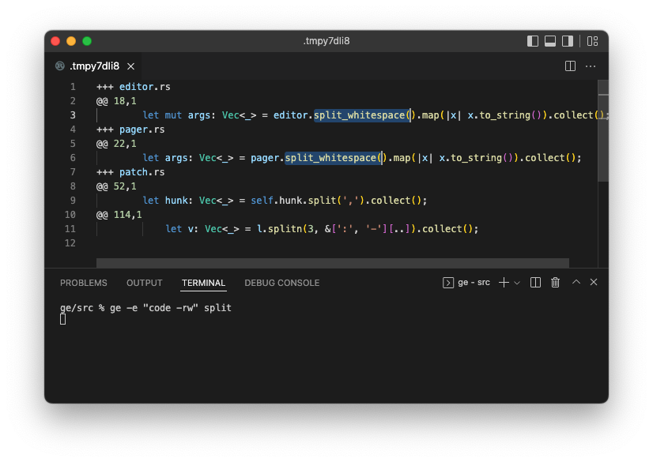

# ge − grep and edit git-tracked files in bulk

**ge** is a tool to edit grep match locations all at once in a single editor pane. It does the following four steps when invoked:

* queries the input word (can be in a regular expression) with **git grep**
* composes a **"half diff"**
* **launches an editor** for users to edit the half diff, and then waits for the user
* converts the edited half diff to a regular unified diff, and feeds it to **git apply**



*Editing two `split_whitespace`s in different files at once, which are found with the keyword `split`.*

## Using different editors

You can use any editor that can be launched from the terminal.

* **vim**: `--editor=vim`
  * You may need to add `:set backupcopy=yes` to your `.vimrc` to prevent ge from losing tempfiles. See [here](http://vimdoc.sourceforge.net/htmldoc/options.html#'backupcopy') for the details.
* **VSCode**: `--editor="code --wait --reuse-window"`
  * Needs the **[Command Line Interface](https://code.visualstudio.com/docs/editor/command-line)** set up in your environment.
  * Needs the `--wait` option for the `code` to wait for the user.
  * `--reuse-window` is recommended if you are in a terminal in VSCode, as it prevents the `code` from opening another window.
* **Sublime Text**: `--editor="rsubl --wait"`
  * Needs the **[Remote Subl](https://github.com/randy3k/RemoteSubl)** plugin installed.
  * Needs the `--wait` option for the `rsubl` to wait for the user.

ge recognizes the environment variable `EDITOR` as well. Note that the `--editor` option takes precedence over the environment variable.

## Arguments and options

```bash
ge [OPTIONS] PATTERN
```

It has one mandatory positional argument:

* `PATTERN` to search with **git grep**. Can be a regular expression (See the `--mode` option for the details).

Some options controls the range to extract with grep:

* `--after-context=N` adds N lines after matches
* `--before-context=N` adds N lines before matches
* `--context=N` adds N lines before and after matches
* `--funciton-context` extends every match to the entire function
* `--to=PATTERN` extends matches downward until the first hit of `PATTERN`

And some options to control the output:

* `--editor=EDITOR` overrides the editor to use. The default is `vi`.
* `--pager=PAGER` overrides the drain for the `--preview` mode. The default is `less -F`.
* `--preview` only dumps half diffs if specified.

It has some more options such as `--header=HEADER` and `--hunk=HUNK`. See `ge --help` for the details.

## "Half diffs" explained

Half diff is a unified diff format with only the target lines. The original lines are cached inside ge during editing and don't appear in the file edited by the user. A typical half diff looks like this:

```
+++ src/editor.rs
@@ 95,1
    fn read(&mut self, buf: &mut [u8]) -> std::io::Result<usize> {
@@ 101,1
    fn write(&mut self, buf: &[u8]) -> std::io::Result<usize> {
+++ src/git.rs
@@ 33,1
    context: Option<usize>,
@@ 41,1
    before: Option<usize>,
@@ 49,1
    after: Option<usize>,
@@ 71,1
    max_depth: Option<usize>,
```

* The `+++` starting at the head of a line is a "header marker", followed by a space and a filename without escaping. It indicates the series of hunks below the header is from the file.
* The `@@` starting at the head of a line is a "hunk marker", followed by a location the hunk took place in the `linenumber,linecount` format. The series of lines below the hunk marker constitutes one grep hit context.
* No line marker, `+` nor `-`, is appended at the head of each line as we don't need to distinguish the original and target lines.
  * Half diffs contain only the target lines.
  * If the target lines contain a string that collides with the header or hunk marker, please use the `--header` or `--hunk` option to change the markers.

## Installation

[Rust toolchain](https://rustup.rs/) is required.

```bash
git clone https://github.com/ocxtal/ge.git
cd ge
cargo build --release
# `ge` is built in `./target/release`. copy it anywhere you want.
```


## Notes

* It doesn't support editing files not tracked by git. It's my design decision to use git as safety equipment to prevent irreparable destruction.
* Not tested on Windows. I don't think it works as it depends on possibly-unix-only features.

## Copyright and license

Hajime Suzuki (2022). Licensed under MIT.

