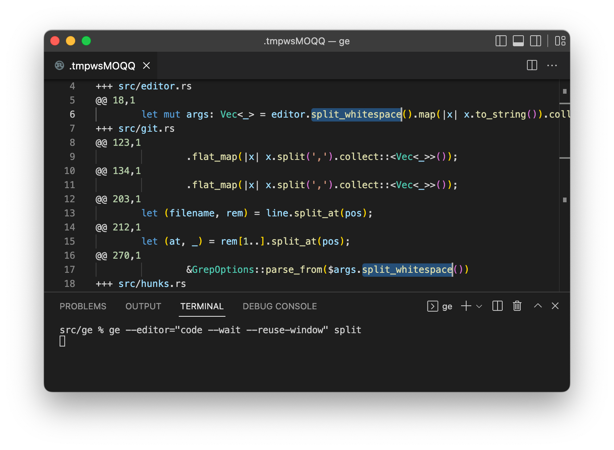

# ge − grep and edit git-tracked files in bulk

**ge** is a tool to edit grep match locations all at once in a single editor pane. It does the following four steps when invoked:

* queries the input word (can be in a regular expression) with **git grep**
* composes **"half diffs"**
* **launches an editor** for users to edit the half diffs, and then waits for the user
* converts the edited half diffs to regular unified diffs, and feeds them to **git apply**



*Editing two `split_whitespace`s in different files at once, which are found with the keyword `split`.*

## Using different editors

You can use any editor that can be launched from the terminal.

* **vim**: `--editor=vim`
  * You may need to add `:set backupcopy=yes` to your `.vimrc` to prevent ge from losing tempfiles. See [here](http://vimdoc.sourceforge.net/htmldoc/options.html#'backupcopy') for the details.
* **VSCode**: `--editor="code --wait --reuse-window"`
  * Needs the **[Command Line Interface](https://code.visualstudio.com/docs/editor/command-line)** set up in your environment.
  * Needs the `--wait` option for the `code` to wait for the user.
  * `--reuse-window` is recommended if you are in a terminal in VSCode, as it prevents the `code` from opening another window.
* **Sublime Text**: `--editor="rsubl --wait"`
  * Needs the **[Remote Subl](https://github.com/randy3k/RemoteSubl)** plugin installed.
  * Needs the `--wait` option for the `code` to wait for the user.

ge recognizes the environment variable `EDITOR` as well. Note that the `--editor` option takes precedence over the environment variable.

## Arguments and options

```bash
ge [OPTIONS] <PATTERN>
```

It has one mandatory positional argument:

* `<PATTERN>` to search with **git grep**. Can be a regular expression (See the `--mode` option for the details).

And five basic options:

* `--editor=EDITOR` overrides the editor to use. The default is `vi`.
* `--header=HEADER` overrides the marker string for headers in half diffs. The default is `+++`.
* `--hunk=HUNK` overrides the marker string for hunks in half diffs. The default is `@@`.
* `--preview` only dumps half diffs if specified.
* `--pager=PAGER` overrides the drain for the `--preview` mode. The default is `less`.

The other options are passed through to the backend **git grep**:

* `--mode=MODE` changes the dialect of the regular expression.
  * Possible ones are `basic` (default), `extended`, `pcre`, and `fixed`.
  * They map to `--basic-regexp`, `--extended-regexp`, `--perl-regexp`, and `--fixed-strings` options of git grep, respectively.
* `--word-regexp`              Match at word boundaries
* `--invert-match`             Invert matches
* `--ignore-case`              Case-insensitive search
* `--after-context=<A>`        Include A additional lines after matches
* `--before-context=<B>`       Include B additional lines before matches
* `--context=<N>`              Include N additional lines before and after matches
* `--funciton-context`         Extend match to the entire function
* `--max-depth=<MAX_DEPTH>`    Maximum directory depth to search [default: inf]

## "Half diffs" explained


## Installation

### Prebuilt binaries

* macOS (aarch64, x86\_64)
* Linux (aarch64, x86\_64)


### From source

```bash
git clone https://github.com/ocxtal/ge.git
cd ge
cargo build --release
# `ge` is built in `./target/release`
```


## Limitations

* It doesn't support editing files not tracked by git. It's my design decision to use git as a safety equipment to prevent irrepairable destruction.
* Not tested on Windows. I don't think it works as it depends on possibly-unix-only features.

## Copyright and license

Hajime Suzuki (2022). Licensed under MIT.

